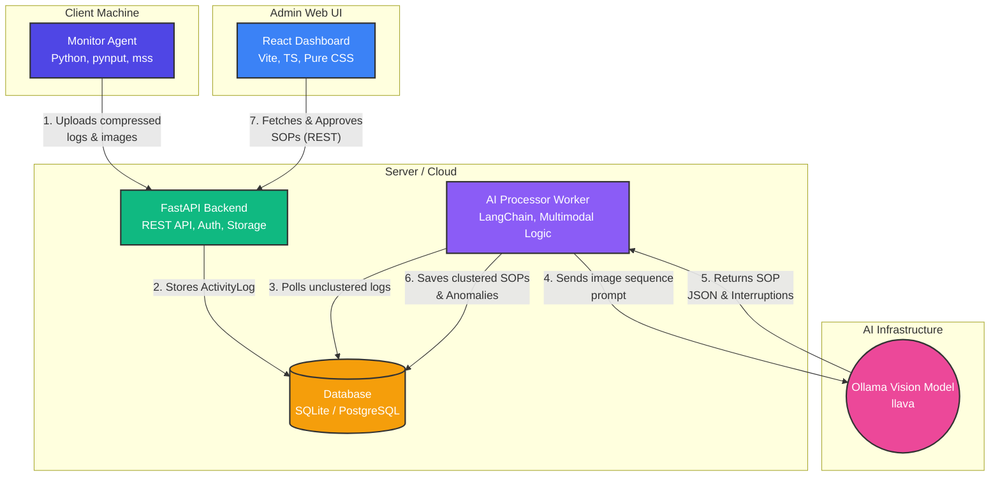

# AI Activity Assist - Documentation

## Overview
AI Activity Assist is an AI-powered User Activity Monitoring system designed to track user interactions, intelligently cluster them into Standard Operating Procedures (SOPs), and detect anomalies or deviations from approved workflows.

## Functionality Supported

### 1. Client-Side Monitoring
- **Activity Tracking**: Captures keystrokes, mouse clicks, and cursor positions natively in the background.
- **Context Awareness**: Tracks the active window title and underlying process/application type.
- **Optimized Visual Capture**: Takes periodic or event-driven screenshots. Images are compressed locally (to 70% JPEG quality, max 1280px width) before transmission to minimize storage and bandwidth costs while preserving legibility for AI vision models.

### 2. Intelligent AI Processing
- **Automated SOP Discovery**: An intelligent background worker analyzes sequences of screenshots and input events using Ollama's Vision models (e.g., `llava`).
- **Resilient Clustering**: Automatically identifies and isolates "context switches" or interruptions (like briefly checking an email or replying to a chat) so they do not pollute the primary SOP sequence.
- **Workflow Naming**: Automatically suggests comprehensive titles and descriptions for discovered processes.

### 3. Analytics and Administration
- **SOP Approval Workflow**: Subject Matter Experts (SMEs) can review AI-generated workflows and approve them as organizational standards.
- **Anomaly Detection**: Live incoming user activity is compared against approved SOP clusters. Deviations trigger anomaly alerts.
- **Optimization Suggestions**: The AI provides actionable insights when an anomaly is detected (e.g., "User typing identical info across two windows; consider an integration script").
- **Pareto Insights**: Visualizes the most frequent task sequences driving business operations.

## Architecture

The system is decoupled into four primary components interacting over HTTP/REST, allowing for scalable deployment.

### System Diagram

### Component Breakdown
1. **Frontend (`frontend/`)**: A rich, responsive React application styled with raw CSS (supporting Dark/Light themes). Provides the administrative dashboard for metrics, SOP review, and anomaly tracking.
2. **Backend API (`api/`)**: A fast, asynchronous REST API built with FastAPI and SQLAlchemy. Handles JWT Auth, secure ingestion of agent logs, and data retrieval for the frontend.
3. **AI Processor (`ai/`)**: A standalone Python polling worker. Connects to the database and interacts via LangChain with an Ollama vision endpoint to categorize activity sequences.
4. **Monitoring Agent (`monitor/`)**: A lightweight daemon running on employee machines, gathering telemetry and visual context in chunks and uploading it securely to the Backend API.
